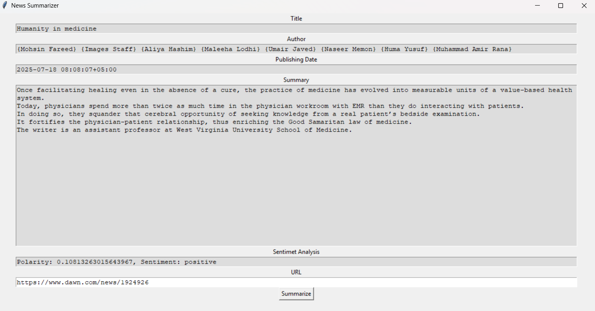

#  News Article Summarizer & Sentiment Analyzer

A Python desktop GUI app built with **Tkinter**, **TextBlob**, and **Newspaper3k** that automatically summarizes any news article from a URL and performs **sentiment analysis** on its content.

---

## Features

- Extracts **title**, **author**, **publication date**, and **summary**
- Performs **sentiment analysis** (positive, negative, neutral)
- Accepts any valid news article **URL**
- Simple, responsive **Tkinter GUI**

---

## Demo



---

## Requirements

- Python 3.10+
- `newspaper3k`
- `textblob`
- `nltk`
- `tkinter` (comes pre-installed with Python)

---

## Installation

Install the dependencies using `pip`:

```bash
pip install newspaper3k textblob nltk
```

download nltk resources
```bash
import nltk
nltk.download('punkt')
```

## How to Run
```bash
python news_summarizer.py
```

Enter a news article URL in the text box, then click Summarize.

## How it works
- newspaper3k: Downloads and parses the article content
- TextBlob: Performs sentiment polarity analysis
- Tkinter: Creates a simple desktop GUI
- NLTK: Used for natural language processing support

## License
This project is for educational and learning purposes only. You may modify and use it freely.

